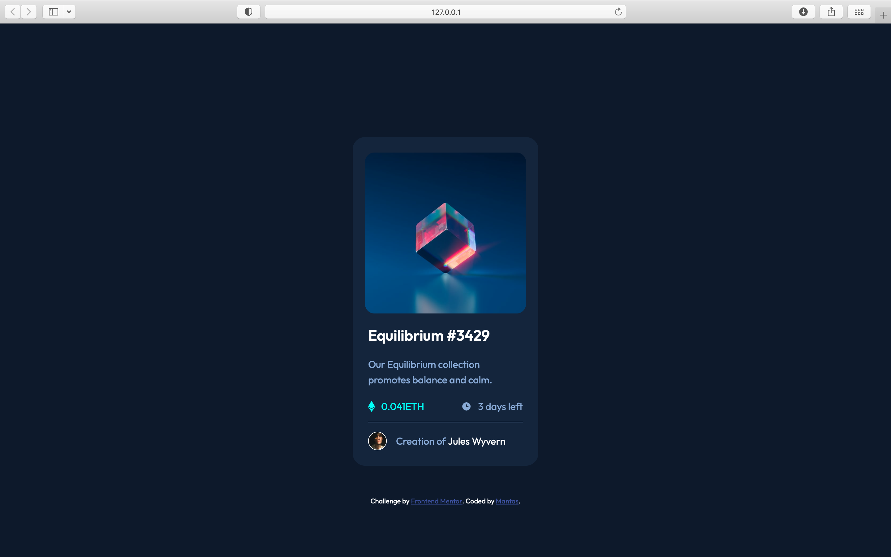

# Frontend Mentor - NFT preview card component solution

This is a solution to the [NFT preview card component challenge on Frontend Mentor](https://www.frontendmentor.io/challenges/nft-preview-card-component-SbdUL_w0U). Frontend Mentor challenges help you improve your coding skills by building realistic projects. 

## Table of contents

- [Overview](#overview)
  - [The challenge](#the-challenge)
  - [Screenshot](#screenshot)
  - [Links](#links)
- [My process](#my-process)
  - [Built with](#built-with)
  - [What I learned](#what-i-learned)
- [Author](#author)

## Overview

### The challenge

- View the optimal layout depending on their device's screen size
- See hover states for interactive elements

### Screenshot




### Links

- Live Site URL: [Live site](https://mantasgarlauskas.github.io/nft-preview-card-component/)

## My process

### Built with

- Semantic HTML5 markup
- CSS custom properties
- Flexbox
- Media queries

### What I learned

Overlap property with CSS - when overlaping image with color and image on hover.
To see how you can add code snippets, see below:

```css
.cover_image:hover {
            background: url('./images/image-equilibrium.jpg') no-repeat center/cover, url('./images/icon-view.svg') no-repeat center hsla(178, 100%, 50%, 0.5);
            background-blend-mode: overlay;
            cursor: pointer;
        }
```

## Author

- LinkedIn - [Mantas](https://www.linkedin.com/in/mantasgarlauskas/)
- Frontend Mentor - [Mantas](https://www.frontendmentor.io/profile/MantasGarlauskas)
- GitHub - [Mantas](https://github.com/MantasGarlauskas)
